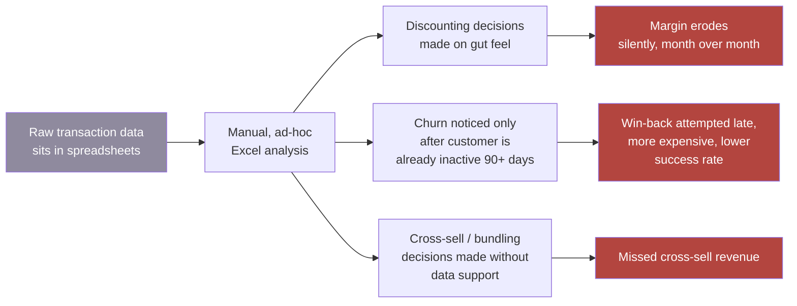

# Process Flow — As-Is vs To-Be
## Profitara — Retail Decision-Making Process

---

## As-Is (before Profitara)

**Pain points:**
- No single source of truth for "is the business healthy right now"
- Churn is reactive — flagged only once a customer has already gone quiet
- Discount policy is not tied to a profit-maximizing benchmark
- Cross-sell decisions rely on intuition, not co-purchase evidence

---

## To-Be (with Profitara)

```mermaid
flowchart LR
    A[Raw transaction CSV] --> B[Automated cleaning +\nfeature engineering]
    B --> C[PostgreSQL analytics layer\n+ live DuckDB SQL Lab]
    B --> D[ML pipeline:\nRF CLV · LogReg churn ·\nK-Means · Apriori · Isolation Forest]
    C --> E[13-page Streamlit dashboard]
    D --> E
    E --> F[Business Health Score\n+ plain-English narrative]
    E --> G[Ranked win-back list\nwith Rs value at stake]
    E --> H[Profit-maximizing discount\nper sub-category]
    E --> I[Cross-sell rules ranked\nby lift]
    F --> J[Faster, evidence-based\nbusiness decisions]
    G --> J
    H --> J
    I --> J

    style A fill:#1B3A5C,color:#fff
    style E fill:#C9971F,color:#1A1F2B
    style J fill:#2F7D4F,color:#fff
```

**What changed:**

| Step | As-Is | To-Be |
|---|---|---|
| Data readiness | Manual Excel wrangling | Automated cleaning + feature engineering pipeline |
| Business health check | No single number; scattered reports | 0–100 Business Health Score, recomputed on any uploaded CSV |
| Churn detection | Noticed after 90+ days of inactivity | RFM segmentation flags "Warming" and "At Risk" before full churn |
| Win-back prioritization | Not prioritized, or prioritized by recency alone | Ranked by revenue at stake (₹) |
| Discount policy | Set by gut feel per category | Profit-vs-discount elasticity curve recommends an exact discount level |
| Cross-sell | Based on merchandiser intuition | Apriori-derived rules ranked by statistical lift |
| Ad-hoc questions | Require a new spreadsheet pivot each time | Answered live via the SQL Analytics Lab, no rebuild needed |

---

## Why this matters for a Business Analyst read

This flow is the kind of before/after mapping a BA would produce during requirements gathering: pin down the current process, name where it breaks down, and show how the proposed solution closes each gap — with the gap quantified in ₹ wherever the data supports it, not left as a vague "improves efficiency" claim.
