<div align="center">


<a href="#">
  
</a>

<br/>

[](https://www.python.org/)
[](https://streamlit.io/)
[](https://scikit-learn.org/)
[](https://duckdb.org/)
[](https://www.postgresql.org/)
[](LICENSE)

**Built by [Dhruv Jain](https://github.com/dhruvjain1824-creator)** · B.Tech CSE (AI & Data Science), BML Munjal University

</div>

<br/>

## 📖 Table of Contents

- [What this is](#-what-this-is)
- [Key results](#-key-results)
- [Screenshots](#-screenshots)
- [Architecture](#-architecture)
- [What's inside — 13 pages](#-whats-inside--13-pages)
- [Machine Learning suite](#-machine-learning-suite)
- [Tech stack](#-tech-stack)
- [Quickstart](#-quickstart)
- [Repo structure](#-repo-structure)
- [Roadmap](#-roadmap)

<br/>

## 🎯 What this is

> Profitara takes a raw **10,000-row retail transaction dataset** — 4,918 orders,
> 1,448 customers, 9 categories / 17 sub-categories, ₹66.95L in revenue — and turns it
> into a full business intelligence platform. Not one chart: a **13-page Streamlit
> dashboard**, **12 trained ML models**, and a live SQL analytics layer, all launched
> with a single command.

Most portfolio dashboards stop at "here's revenue by month." Profitara was built to
answer what a retail business actually asks: *which customers are about to churn, and
what are they worth? Where is the discount strategy bleeding margin? What should be
cross-sold together? What does next quarter look like?*

<br/>

## 🏆 Key results

<div align="center">

| Model | Task | Result |
|:---|:---|:---:|
| 🌲 **Random Forest** | Customer Lifetime Value prediction |  |
| 📉 **Logistic Regression** | Churn classification |   |
| 🧩 **K-Means** | Customer segmentation |  → 119 "Champion" customers |
| 🔗 **Apriori** | Market basket analysis |  cross-sell rules |
| 🌳 **Isolation Forest** | Discount-abuse detection | Flags anomalous discount patterns |
| 📈 **Holt-Winters** | Revenue forecasting | 6-month exponential-smoothing forecast |

</div>

<br/>

## 📸 Screenshots

<div align="center"><i>Live from the deployed dashboard — every module below is real computation on the dataset, not a static mockup.</i></div>
<br/>

**🏠 Overview & Health**

<table>
<tr>
<td width="50%">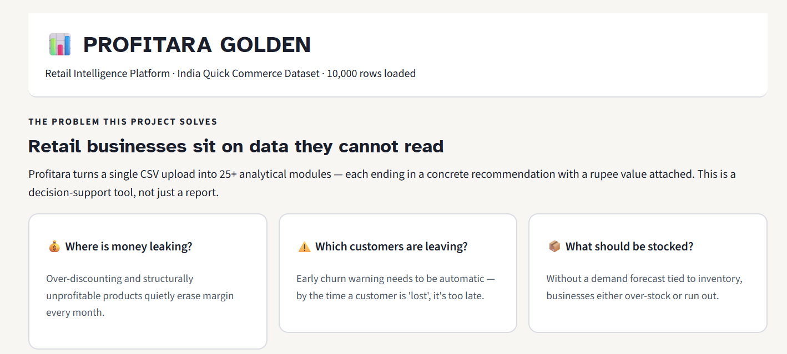</td>
<td width="50%">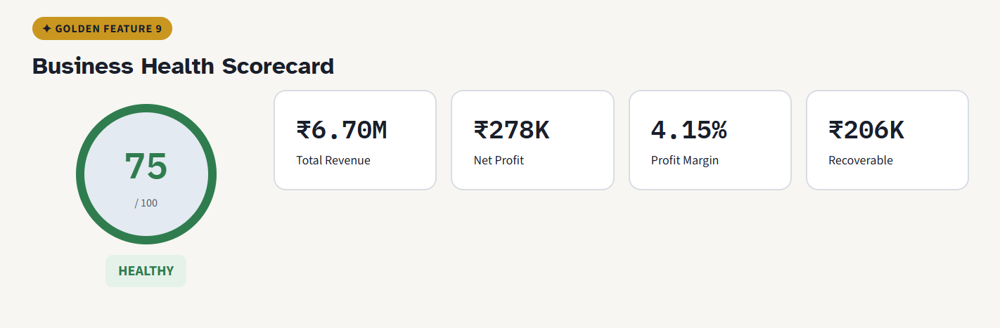</td>
</tr>
<tr>
<td align="center"><i>Problem framing + at-a-glance module cards</i></td>
<td align="center"><i>0–100 Business Health Scorecard</i></td>
</tr>
</table>

<p align="center">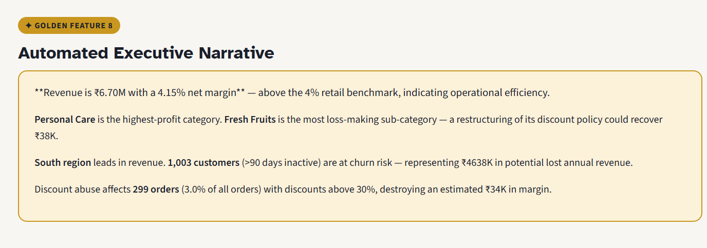</p>
<p align="center"><i>Auto-generated executive narrative — plain-English read of the numbers above, no manual write-up needed</i></p>

<br/>

**⚠️ Churn Early Warning**

<table>
<tr>
<td width="50%">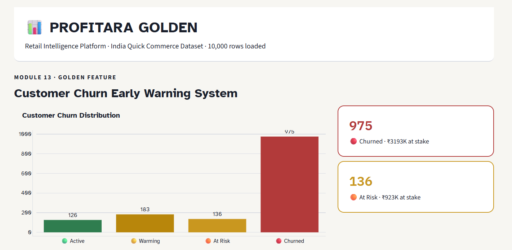</td>
<td width="50%">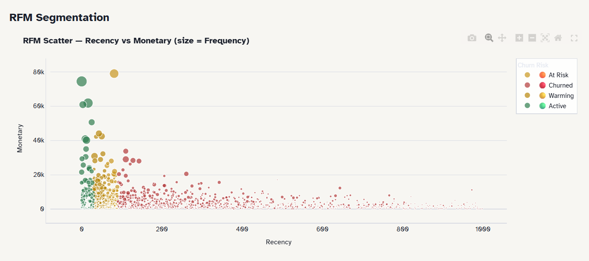</td>
</tr>
<tr>
<td align="center"><i>Churn distribution — Active / Warming / At Risk / Churned</i></td>
<td align="center"><i>RFM segmentation (bubble size = purchase frequency)</i></td>
</tr>
</table>

<p align="center">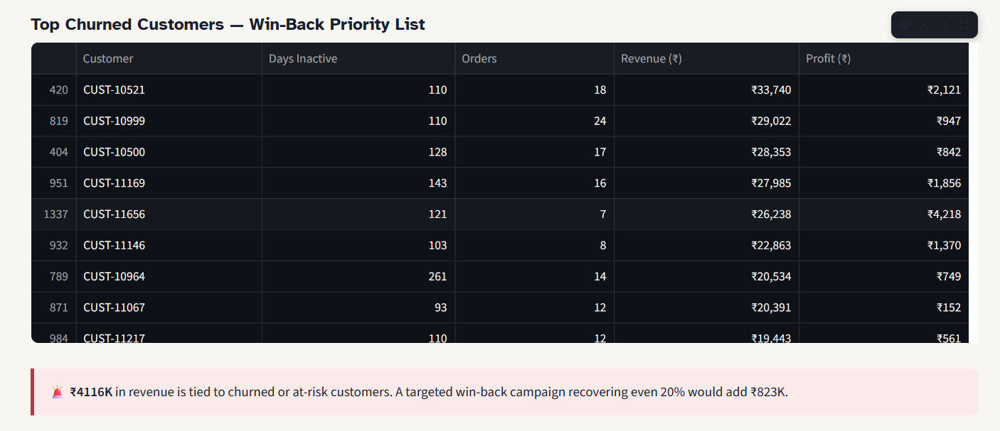</p>
<p align="center"><i>Win-back priority list, ranked by revenue at stake</i></p>

<br/>

**💡 Discount Elasticity & Price Optimization**

<p align="center">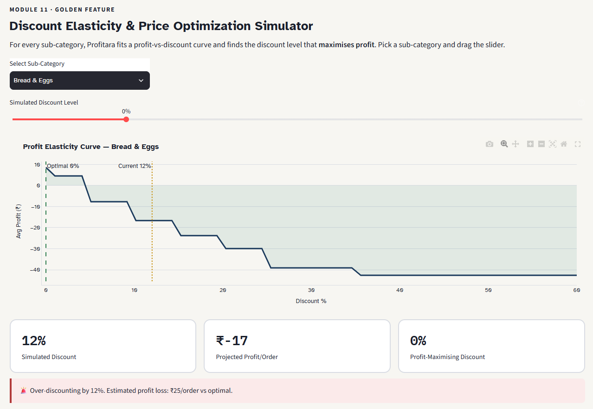</p>
<p align="center"><i>Interactive profit-vs-discount curve — finds the profit-maximizing discount per sub-category</i></p>

<br/>

**🔗 Market Basket Analysis — Cross-Sell Engine**

<table>
<tr>
<td width="50%">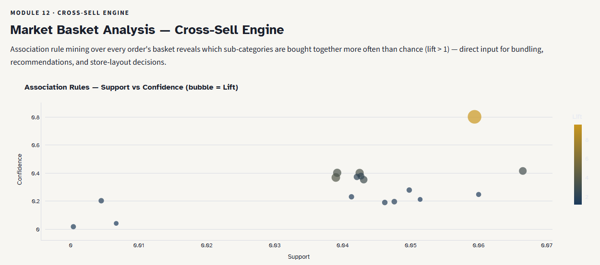</td>
<td width="50%">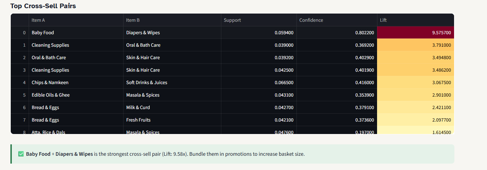</td>
</tr>
<tr>
<td align="center"><i>Association rules — support vs confidence (bubble = lift)</i></td>
<td align="center"><i>Top cross-sell pairs, gradient-ranked by lift</i></td>
</tr>
</table>

<br/>

**📉 Cohort Retention & Survival Analysis**

<table>
<tr>
<td width="50%">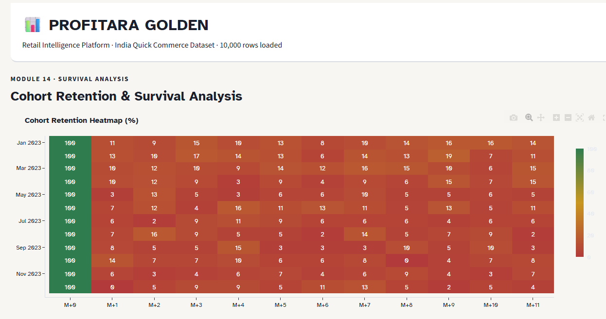</td>
<td width="50%">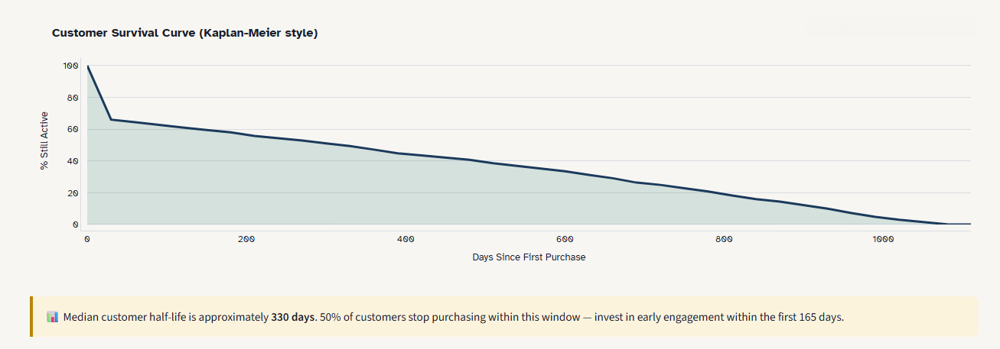</td>
</tr>
<tr>
<td align="center"><i>Cohort retention heatmap by signup month</i></td>
<td align="center"><i>Kaplan-Meier style customer survival curve</i></td>
</tr>
</table>

<br/>

**🤖 12 ML Modules — CLV Prediction**

<table>
<tr>
<td width="50%">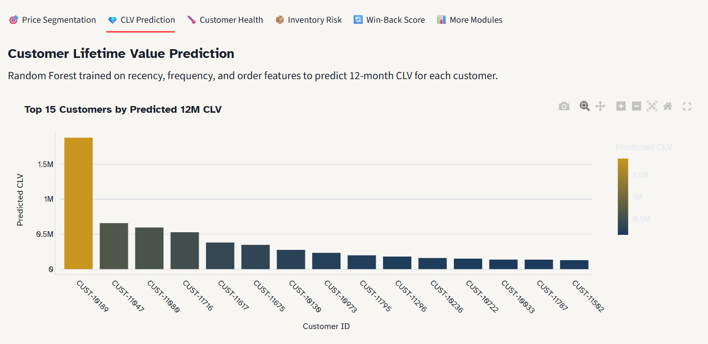</td>
<td width="50%">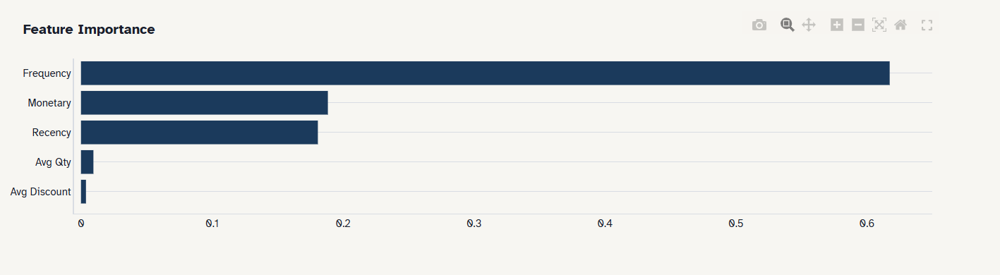</td>
</tr>
<tr>
<td align="center"><i>Random Forest — top 15 customers by predicted 12-month CLV</i></td>
<td align="center"><i>Feature importance driving the CLV model</i></td>
</tr>
</table>

<br/>

**🧮 SQL Analytics Lab**

<p align="center">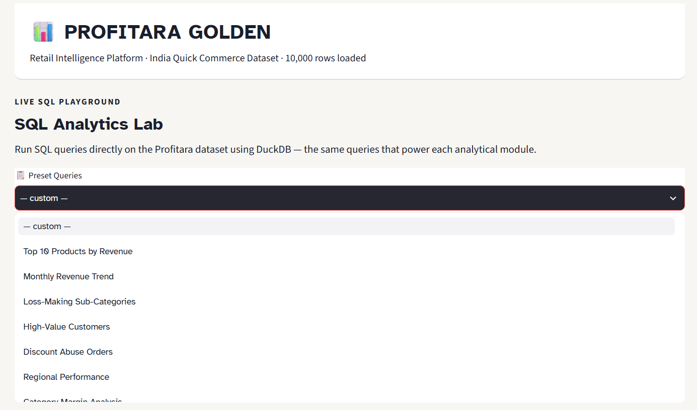</p>
<p align="center"><i>Preset queries, ready to run against the live dataset</i></p>

<table>
<tr>
<td width="50%">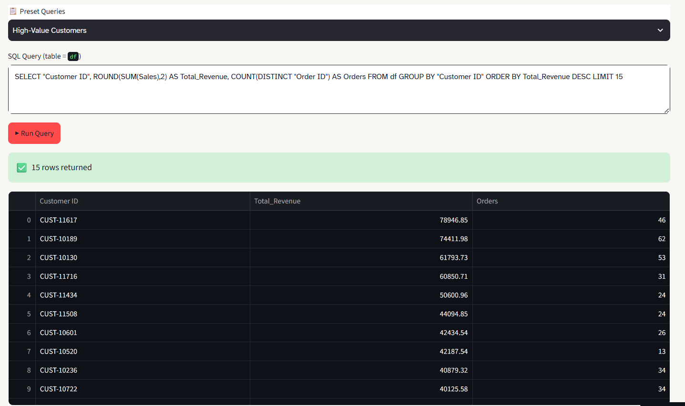</td>
<td width="50%">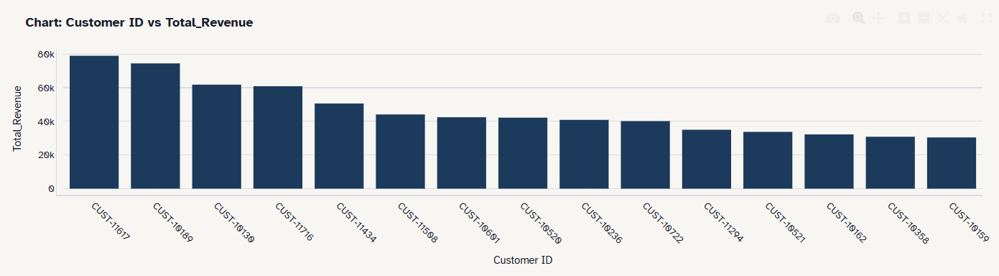</td>
</tr>
<tr>
<td align="center"><i>Live DuckDB query — "High-Value Customers" preset</i></td>
<td align="center"><i>Auto-charted result</i></td>
</tr>
</table>

<br/>

## 🏗️ Architecture

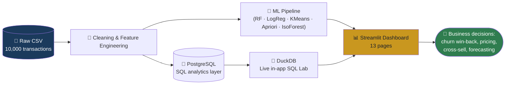

<br/>

## 📊 What's inside — 13 pages

<details open>
<summary><b>Click to expand the full page-by-page breakdown</b></summary>
<br/>

| Page | What it does |
|---|---|
| 🏠 **Overview & Health** | 0–100 business health scorecard + auto-generated executive narrative |
| 📊 **Core KPIs** | 8 core KPIs with YoY trends and segment breakdowns |
| 📈 **Sales & Categories** | Category performance, monthly trend, regional margin, segment mix |
| 🛒 **Products & Discounts** | Top-10 products, discount-band analysis, Pareto 80/20 breakdown |
| 💡 **Elasticity Simulator** | Interactive discount optimizer per sub-category |
| 🔗 **Market Basket Analysis** | Apriori rules, lift scatter, cross-sell recommendation table |
| ⚠️ **Churn Early Warning** | RFM segmentation + win-back priority list |
| 📉 **Cohort Retention** | Cohort heatmap + Kaplan-Meier survival curve |
| 🗺️ **Geo Intelligence** | State/city-level sales and margin mapping |
| 💸 **Leakage & Abuse** | Revenue leakage detection, discount-abuse flags, AOV trend |
| 🤖 **12 ML Modules** | Segmentation, CLV, churn, inventory risk, win-back scoring, and more |
| 🔮 **Forecasts & Trends** | 6-month revenue forecast, quarterly trend, demand heatmap |
| 🧮 **SQL Analytics Lab** | Live DuckDB SQL editor with preset queries against the dataset |

*Drop your own CSV in from the sidebar — every module above recomputes on your data.*

</details>

<br/>

## 🤖 Machine Learning suite

<details>
<summary><b>Click to expand the 12 ML modules</b></summary>
<br/>

- 🎯 **Price Sensitivity Segmentation** (K-Means) — clusters customers by discount usage and order frequency
- 💎 **CLV Prediction** (Random Forest, R² = 0.930)
- 🌡️ **Customer Health Scoring**
- 📦 **Inventory Risk** flagging
- 🔄 **Win-Back Scoring** (Logistic Regression, AUC = 0.91)
- 📊 Plus BCG-matrix product classification, seasonal decomposition, and more under "More Modules"

</details>

<br/>

## 🛠️ Tech stack

<div align="center">

| Layer | Tools |
|---|---|
| **App / dashboarding** | Streamlit · Plotly |
| **Machine Learning** | scikit-learn (RF, LogReg, K-Means, Gradient Boosting) · mlxtend (Apriori) |
| **Data** | Pandas · NumPy |
| **SQL** | DuckDB (live in-app) · PostgreSQL (source layer) |
| **Design system** | Atkinson Hyperlegible + IBM Plex Mono · custom teal/amber theme matched 1:1 to a standalone HTML dashboard |

</div>

<br/>

## 🚀 Quickstart

<table>
<tr><td>

**🪟 Windows**
```bash
run.bat
```

</td><td>

**🐧 Mac / Linux**
```bash
chmod +x run.sh
./run.sh
```

</td><td>

**⚙️ Manual**
```bash
pip install -r requirements.txt
streamlit run app.py
```

</td></tr>
</table>

Then open **`http://localhost:8501`** — verified end-to-end against the bundled dataset before this README was written.

<br/>

## 📁 Repo structure

```
profitara/
├── app.py                          # Main Streamlit dashboard — all 13 pages
├── Profitara_India_Dataset.csv     # Dataset (10,000 rows)
├── Profitara_ML_Pipeline.ipynb     # Model training notebook (CLV, churn, segmentation, market basket)
├── Profitara_Complete.sql          # PostgreSQL analytics layer
├── Profitara_Golden_Dashboard.html # Standalone HTML version of the dashboard
├── 01_overview_cards.png           # Dashboard screenshots used in this README
├── 02_health_scorecard.png
├── 03_executive_narrative.png
├── 04_churn_distribution.png
├── 05_winback_priority.png
├── 06_rfm_scatter.png
├── 07_elasticity_simulator.png
├── 08_market_basket_scatter.png
├── 09_cross_sell_pairs.png
├── 10_cohort_heatmap.png
├── 11_survival_curve.png
├── 12_clv_prediction.png
├── 13_feature_importance.png
├── 14_sql_lab.png
├── 15_sql_query_result.png
├── 16_sql_result_chart.png
├── requirements.txt
├── run.sh / run.bat                # One-click launchers
└── README.md
```

<br/>

## 🗺️ Roadmap

- [ ] Power BI integration (in progress)
- [ ] Deployed public demo link

<br/>

<div align="center">

**[Dhruv Jain](https://github.com/dhruvjain1824-creator)** · [LinkedIn](https://www.linkedin.com/in/dhruvjain1824)


</div>
