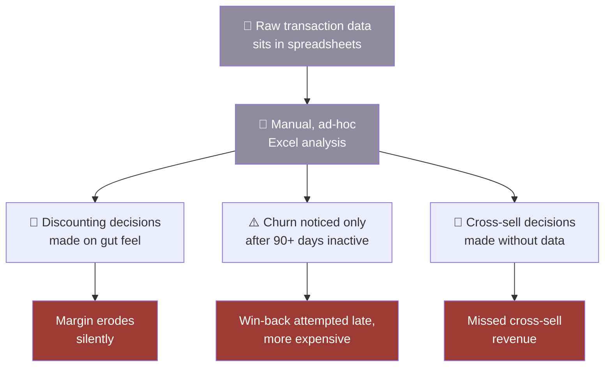
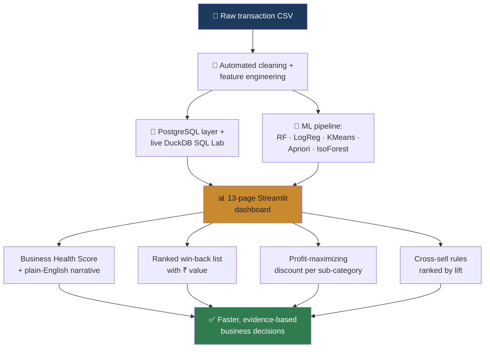

## 🔴 As-Is — before Profitara

<b>Pain points (click to expand)</b>

 

- No single source of truth for whether the business is healthy right now
- Churn is reactive — flagged only once a customer has already gone quiet
- Discount policy is not tied to a profit-maximizing benchmark
- Cross-sell decisions rely on intuition, not co-purchase evidence

 

---

## 🟢 To-Be — with Profitara

 

## 🔀 What changed, step by step

| Step | 🔴 As-Is | 🟢 To-Be |
|---|---|---|
| **Data readiness** | Manual Excel wrangling | Automated cleaning + feature engineering pipeline |
| **Business health check** | No single number; scattered reports | 0–100 Business Health Score, recomputed on any uploaded CSV |
| **Churn detection** | Noticed after 90+ days of inactivity | RFM segmentation flags "Warming" and "At Risk" before full churn |
| **Win-back prioritization** | Not prioritized, or by recency alone | Ranked by revenue at stake, in ₹ |
| **Discount policy** | Set by gut feel per category | Elasticity curve recommends an exact profit-maximizing discount |
| **Cross-sell** | Based on merchandiser intuition | Apriori-derived rules ranked by statistical lift |
| **Ad-hoc questions** | A new spreadsheet pivot each time | Answered live via the SQL Analytics Lab, no rebuild needed |

 

---

## 🎓 Why this matters for a Business Analyst read

This flow is the kind of before/after mapping a BA produces during requirements gathering: pin down the current process, name where it breaks down, and show how the proposed solution closes each gap — quantified in ₹ wherever the data supports it, not left as a vague "improves efficiency" claim.

 

<i>PROFITARA · Dhruv Jain · <a href="./README.md">← back to index</a></i>

