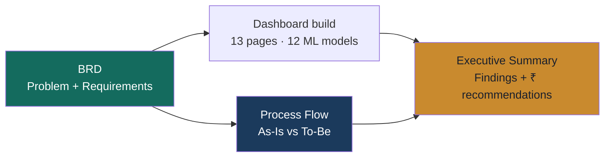

 

## 📁 What's in this folder

This folder documents the **business-analyst side** of the Profitara build — the requirements, findings, and process thinking that sit behind the ML pipeline and dashboard, presented the way a BA would hand them to a stakeholder.

| Document | What it answers | Read this if you're... |
|---|---|---|
| 📋 [`BRD_Profitara.md`](./BRD_Profitara.md) | What was the business problem, who are the stakeholders, and what exactly was scoped? | Reviewing this as a requirements/scoping exercise |
| 📊 [`Executive_Summary_Profitara.md`](./Executive_Summary_Profitara.md) | What did the data actually find, in plain English with ₹ recommendations? | A non-technical stakeholder who wants the 2-minute version |
| 🔀 [`Process_Flow_Profitara.md`](./Process_Flow_Profitara.md) | How does the business process change before vs. after Profitara? | Interested in the before/after operational impact |

 

## 🧭 How these fit together

The BRD defines *why* the project exists and *what* it had to deliver. The Executive Summary reports *what was found*. The Process Flow shows *what changed* operationally as a result.

 

## 🎯 Quick facts referenced across all three docs

| Metric | Value |
|:---|:---:|
| Business Health Score | **75 / 100 — Healthy** |
| Total Revenue | **₹6.70M** |
| Net Profit Margin | **4.15%** |
| Revenue tied to churn risk | **₹4,116K** |
| Recoverable via 20% win-back | **₹823K** |
| Cross-sell rules discovered | **52** (top: Baby Food → Diapers & Wipes, lift 9.58×) |

 

<i>Part of the <a href="https://github.com/jaindhruv1923/Project-Profitara-Retail-BI-Pipeline">Profitara</a> project · Dhruv Jain</i>

